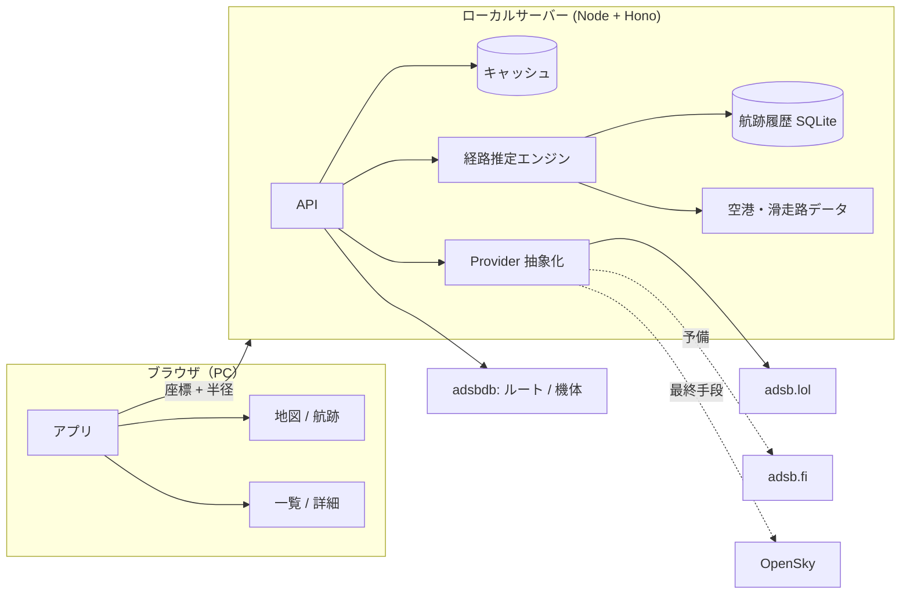

# FlightBoard 仕様書（ドラフト v0.8）

> 作成日: 2026-09-15（最終更新 2026-09-16）
> ステータス: **Phase 1（MVP）実装完了**（15 章）。Phase 0.5 で、AIP の PDF からの SID/STAR・進入方式（IAP）の抽出と実機との照合も検証済み（10.3・10.4）
> 決定事項: PC向けWeb / ローカル起動 / 自分・知人だけで利用 / 旅客機＋貨物機 / 対象空港は羽田＋成田 / 出発・進入経路の推定

---

## 1. 概要

ユーザーの現在地の近くを飛んでいる航空機（主に旅客機）をリアルタイムに一覧・地図で表示するアプリ。
「いま頭上を飛んでいる飛行機はどこの便で、どこへ向かっているのか」「どの経路で降りてきているのか」がすぐにわかることを目指す。

### 1.1 コアとなる体験

1. アプリを開く（地点は保存済み。初回だけ設定する）
2. 近い順に機体の一覧が出る（便名・航空会社・出発地 → 到着地・高度・距離）
3. **「北東の空、見上げる角度 32°」** のように、空のどちらを見ればよいかがわかる
4. **「羽田 RWY22 進入（南風運用）」** のように、どの滑走路へ向かっているかがわかる
5. クリックすると機体の詳細（機種・登録記号・写真・ルート・航跡）が見られる

### 1.2 ほかのフライトトラッカーとの違い

Flightradar24 のような「世界地図を眺めるアプリ」ではなく、**「自分の頭上」に絞った体験**にする。

- 最初に出るのは地図ではなく、**近い順の一覧**
- 自分から見た**方角と見上げる角度**を出す（窓から実際に見つけられるように）
- **頭上の機体がどの経路・どの滑走路を使っているかを推定する**（他のアプリにはない）
- 旅客機と貨物機に絞る（自家用機・軍用機は表示しない）

---

## 2. 想定ユーザーと利用シーン

PC の前にいるときに、窓の外や空の音が気になったタイミングで開く。自宅・職場のデスクトップでの利用を想定する。

| シーン | 必要になること |
|---|---|
| 飛行機の音が聞こえた。何の便か知りたい | 近い順の一覧がすぐ出ること |
| 窓から見える機体を特定したい | 方角と見上げる角度 |
| 今日はいつもと違う方向から降りてくる | 滑走路・運用方向・経路の推定 |
| 自宅上空を通る機材を眺める | 機種・登録記号・写真 |

---

## 3. スコープ

### 3.1 MVP（Phase 1）

- 地点の設定（自動取得＋手動指定。設定は保存する）
- 周辺の機体を取得して一覧表示（距離順）
- 地図表示（機体アイコン・半径の円・航跡）
- 機体の詳細表示（ルート・機種・登録記号・写真）
- 自動更新
- 旅客機・貨物機フィルタ
- 方角と見上げる角度の表示

### 3.2 Phase 2

- **出発・進入経路の推定（レベル1: 滑走路・フェーズ・運用方向）**
- 地点の複数登録、設定画面、エラー処理

### 3.3 Phase 3 以降

- **経路推定のレベル2a（AIP の PDF/SVG 読み取り）** → 2b（AIXM へ差し替え）
- 経路推定のレベル3（航跡からの自動抽出）
- スマホ対応（レスポンシブ・PWA）
- 頭上を通過するときの通知
- 見た機体の履歴（ログブック）

---

## 4. 機能要件

### F-01 地点の設定

PC のブラウザでは位置情報の精度が低い（Wi-Fi や IP アドレスから推定するため、数 km 〜 数十 km ずれることがある）。**そのため、手動で地点を指定する方法を主役とする。**

- 初回起動時: Geolocation API で取得を試み、取得できたら地図上にピンを出して「ここでよいか」を確認させる
- **地図をクリックして地点を修正できる**（ピンのドラッグも可）
- 確定した地点と標高は localStorage に保存し、次回以降はそのまま使う
- 地点は設定画面でいつでも変更できる。複数の地点を登録して切り替えられると望ましい（自宅・職場）
- 標高は手入力できるようにする（見上げる角度の計算に効く。既定 0m）

### F-02 周辺機体の取得

- 検索半径: **既定 50km**（10 / 25 / 50 / 100 km から選べる）
- BFF（後述）経由で取得する
- 位置の最終受信（`seen_pos`）から 60 秒を超えた機体は表示しない

### F-03 一覧表示

- 並び順: **距離が近い順**（既定）。**仰角が高い順**・高度順・便名順にも切り替えられる
  - 利用地点では仰角 5° 未満の機体が大半だった（6.5）。建物に隠れて見えないことが多いので、**仰角 10° 未満は薄く表示**して「見える見込み」を示す
- 1件ごとの表示項目:
  - 便名（例: `ANA245`）、航空会社名
  - 出発空港 → 到着空港（IATA コードと都市名）
  - 機種（例: B767-300）
  - 高度・対地速度・上昇／下降／水平のアイコン
  - 距離・方角・見上げる角度
  - **経路の推定バッジ**（例: `HND RWY22 進入`）
- 件数と最終更新時刻を表示する（例: 「周辺 12 機・5 秒前に更新」）
- **0 件のとき**: 「近くに飛行機はいません」と表示し、半径を広げるボタンを出す

### F-04 地図表示

- 現在地・検索半径の円・機体アイコンを表示する
- 機体アイコンは進行方向（`track`）に合わせて回転させる
- 一覧で選んだ機体は地図上でハイライトし、逆に地図でクリックすると一覧の該当行に移る
- 選択中の機体の**航跡**を線で表示する
- 経路推定が当たっている場合、**推定した経路の線を重ねて表示する**（Phase 3・レベル2以降）

### F-05 機体の詳細

| 区分 | 項目 |
|---|---|
| フライト | 便名、航空会社、出発地 → 到着地、ルートの信頼度 |
| 機体 | 機種名、登録記号（例: JA873A）、機体写真（**撮影者名とリンク付き**。取得できなければ写真なし）、ICAO 24bit アドレス |
| 飛行状態 | 気圧高度、GNSS 高度、対地速度、進行方向、昇降率、目標高度（`nav_altitude_mcp`）、スコーク |
| **経路** | **推定フェーズ（出発/進入/通過）、空港、滑走路、運用方向、一致度** |
| 自分との関係 | 水平距離、直線距離、方角、見上げる角度 |

### F-06 自動更新と表示の補間

- ポーリング間隔: **既定 10 秒**（設定で 5〜30 秒）
- タブが非表示のとき（`visibilitychange`）はポーリングを止める
- 取得の合間は対地速度と進行方向から位置を推定し、アイコンを滑らかに動かす（最大 30 秒まで）

### F-07 表示する機体のフィルタ

- 既定は **「旅客機＋貨物機のみ」**。判定は「10. 機体の判定ロジック」
- 貨物便には「貨物」バッジを付ける
- 地上にいる機体は既定で除外する。軍用機・自家用機は表示しない

### F-08 方角と見上げる角度

- 自分から機体への**方位**を 16 方位の日本語で表示する（例: 北北東）
- 機体を**見上げる角度**（仰角）を表示する。計算式は「11. 計算仕様」

### F-09 設定

- 地点、検索半径、更新間隔、表示する機体の種類
- 単位: 高度 m / ft、速度 km/h / kt（**既定は m と km/h**）
- 設定は localStorage に保存する

### F-10 出発・進入経路の推定 ★新規

**前提: ADS-B は飛行計画の経路を送信しない。** 機体は「次にどのウェイポイントへ向かうか」を放送していないので、**位置・高度・進行方向の履歴から幾何的に推測するしかない**。したがって表示には必ず「推定」であることと確からしさを添える。

実現の難易度が段違いなので、3 つのレベルに分けて段階的に作る。

#### レベル1: 滑走路・フェーズ・運用方向の推定（Phase 2）

**公開データだけで実現でき、実測で精度を確認済み（6.2-6 参照）。**

- 出力例:
  - `羽田 RWY22 進入（南風運用）`
  - `羽田 RWY16L 出発 → 南西へ上昇中`
  - `通過（巡航 11,000m）`
- 必要なデータ: OurAirports の `runways.csv`（パブリックドメイン。滑走路端の座標と真方位）
- 判定ロジックは「10.2 経路推定ロジック」

#### レベル2: 名前付き経路との照合（Phase 3）

出力例: `推定経路: ◯◯ ONE ARRIVAL（一致度 87%）`

経路の定義データをどこから得るかで 3 つの実装がある。**2a を先に作り、AIXM が手に入ったら 2b に差し替える。**

**2a: AIP の PDF を読み取る** ← **当面の実装（実物で検証済み）**

- 入手元: SWIM の **AIP ファイルダウンロードサービス**（アカウントがあれば申請不要）。ENR と、空港ごとの AD2 の PDF
- **日本の AIP は、RNAV の SID/STAR を「コード化された表」（区間の種類・ウェイポイント・高度制限）で載せている**。図を解析しなくても、表から手順を起こせる
- ウェイポイントの座標は ENR 4.3・ENR 4.1・空港ごとの表から取り、互いに突き合わせて検証する
- 実測: 羽田・成田の SID/STAR/トランジション 186 本と進入方式（IAP）62 本を抽出し、ウェイポイントの座標化は 100%。実機との照合では、出発直後の機体が手順の折れ線から 20〜50m のズレで一致した（詳細は 10.3・10.4）
- **人手での確認を必ず挟む**: 抽出結果を地図に重ねて表示し、ユーザーが確認してから採用する

**2b: SWIM の AIP データ（AIXM）を使う** ← 将来の本命

- AIP データ配信サービスの利用申請を出す（審査 約2週間）
- AIXM をパースして飛行方式とウェイポイント座標を取り出し、ローカル DB に格納する
- AIRAC 周期（28日）で更新されるので、**取り込みは手動コマンド（`npm run import-aixm`）**にする
- **2a と同じ内部形式（`NamedRoute`）に落とす**ので、アプリ側の照合ロジックは変更不要。差し替えるだけで済むように作る
- リスク: AIXM に飛行方式が含まれない可能性がある（6.4）。その場合もウェイポイント座標は得られるため、2a の精度向上に使える

**2c: 自分で経路を定義する**（最終手段・補完）

- **経路エディタ**: 地図をクリック、またはウェイポイント名を並べて経路を定義し、名前を付けて保存する
  - 定義項目: 名前、空港、滑走路、種別（出発/進入）、折れ線（座標列）、有効な高度帯、有効な時間帯（羽田の都心上空の進入は夕方の時間帯のみ、といった条件）
- 2a の抽出結果の修正にも、この同じ UI を使う

**照合**（2a・2b・2c 共通）: 機体の航跡と各経路の折れ線を比較して採点し、しきい値を超えたら「一致度 87%」のように表示する（採点式は 10.2）

#### レベル3: 航跡からの経路の自動抽出（Phase 3 以降）

- アプリを動かしている間、BFF が航跡を SQLite に蓄積する
- 空港・滑走路・フェーズごとに航跡をクラスタリングし、代表経路（中央値のパス）を抽出する
- 「**経路 #3**（RWY22 進入・北東から進入）: 過去 127 機が使用」のように提示し、ユーザーが名前を付けられる
- 利点: **管制のレーダー誘導を反映した実態どおりの経路**が得られる（公示経路そのままに飛ぶとは限らないため、むしろ実用的）
- 欠点: アプリを動かした時間に比例してしか精度が上がらない

---

## 5. 非機能要件

| 分類 | 要件 |
|---|---|
| 性能 | 起動から一覧の表示まで 3 秒以内 |
| 対応環境 | デスクトップの Chrome / Edge / Safari の最新 2 バージョン。画面幅 1280px 以上 |
| 画面 | 左に一覧、右に地図の 2 ペイン構成 |
| 起動 | ローカルで `npm start` → ブラウザで `localhost` を開く |
| オフライン | 回線が切れたら最後のデータを「◯秒前」の表示付きで残す |
| API の制限 | 上流 API のレート制限を守る。1 回のポーリングあたりの上流リクエストは 3 本まで |
| 可用性 | 上流 API が落ちたら予備のデータソースに自動で切り替える |
| アクセシビリティ | 色だけで情報を伝えない。キーボードで一覧を辿れる |
| 言語 | 日本語 |

---

## 6. データソース（Phase 0 で実測検証済み）

### 6.1 検証結果（2026-09-15、羽田空港 35.5494 / 139.7798 を中心に半径 50NM）

| API | 取得機数 | 応答時間 | 認証 | 備考 |
|---|---|---|---|---|
| **adsb.lol** | **59 機** | 約 1.2 秒 | 不要 | 52/59 に登録記号と機種コードあり。配列は `ac` |
| **adsb.fi** | **59 機** | 約 1.3 秒 | 不要 | 内容はほぼ同等。配列は **`aircraft`**（名前が違う）。`desc`（機種の正式名）も返る。**実装時に v2 は非推奨と判明し、v3 を使っている** |
| **OpenSky（匿名）** | 58 機 | 約 2.6 秒 | 不要（匿名 400 クレジット/日） | 登録記号・機種コードを**返さない**。高度は m |
| **adsbdb**（ルート） | — | 約 0.2 秒/件 | 不要 | 飛行中のコールサイン 30 件中 **29 件（97%）でルート取得成功** |
| **OurAirports**（空港・滑走路） | — | CSV 一括 | 不要 | **パブリックドメイン**。滑走路端の座標と真方位を含む。経路推定の土台 |

**結論: 日本（少なくとも関東）のカバレッジは実用十分。無料データだけで、経路推定まで含めて成立する。**

### 6.2 検証でわかった重要な点

1. **エミッタカテゴリでの旅客機判定は日本では効かない**
   ANA725（B737-800）、ANA245（B767-300）、JAL255 がいずれもカテゴリ **A0（情報なし）**。59 機中 17 機が A0。
   → **コールサインと機種コードで判定する**（10.1）

2. **軍用機は `dbFlags` で除外できる**
   航空自衛隊の KC-2（COSMO02 / 58-1219）に `dbFlags = 1` が立っていた。

3. **adsb.lol の `routeset` はルート取得用ではない**（POST すると 201 と空レスポンス）
   → ルート取得は **adsbdb** を使う

4. **adsb.lol と adsb.fi は CORS ヘッダーを返さない**
   → ブラウザから直接呼べない。**サーバー側の中継（BFF）が必須**（adsbdb は `*` を返すので直接呼べる）

5. **ADS-B から取れる情報は想像以上に多い**
   `ias`・`mach`・`oat`（外気温）・`ws`/`wd`（風速・風向）・`nav_altitude_mcp`（機体が設定している目標高度）・`squawk`・`mlat`。
   → 「上昇中（目標 12,000m）」のような表示ができる

6. **滑走路の推定は、実測で非常に高い精度が出た** ★経路推定の根拠
   羽田 30NM 圏の実データに、OurAirports の滑走路データを突き合わせたところ、進入中の 4 機すべてを滑走路まで特定できた。

   | 便名 | 機種 | 高度 | 推定 | 滑走路までの距離 | 方位のズレ |
   |---|---|---|---|---|---|
   | ANA642 | A321 | 200ft | RWY22 進入 | 1.0km | 0.3° |
   | JAL38 | B767-300 | 1,825ft | RWY22 進入 | 10.7km | 0.1° |
   | SKY706 | B737-800 | 3,350ft | RWY23 進入 | 19.9km | 1.0° |
   | ANA862 | B787-8 | 3,600ft | RWY22 進入 | 21.5km | 0.2° |

   **方位のズレは 0.1〜1.0°**。最終進入に入った機体は滑走路の延長線に極めて正確に乗るため、取り違えはまず起きない。
   さらに、この 4 機を集計すれば「現在の羽田は **RWY22/23 に着陸中＝南風運用**」と自動判定できる。

### 6.3 採用する構成

- **位置情報**: adsb.lol を主に使い、失敗したら adsb.fi、最後に OpenSky（匿名）
- **ルート**: adsbdb（コールサイン → 出発地・到着地・航空会社）
- **機体情報と写真**: adsbdb（ICAO アドレス → 機種・写真）
- **空港・滑走路**: OurAirports の CSV をビルド時に取り込み、ローカルに持つ（28日ごとの更新は不要。年1回程度でよい）
- **経路・ウェイポイント（Phase 3）**: SWIM の AIP データ配信サービス（AIXM）。手動コマンドで取り込む（6.4）
- データソースは **Provider インターフェースで抽象化する**

### 6.4 経路（SID/STAR）データの入手可否 — 調査結果

**結論: 民間のフライトシミュレータ系データは全滅だが、国土交通省の SWIM から AIP データ（AIXM）を入手できる見込みが高い。**

| 入手先 | 可否 | 理由 |
|---|---|---|
| **SWIM（国土交通省 航空情報共有基盤）** | **◎ 本命** | 個人でもアカウント登録可。AIP データ配信サービス（AIXM、AIRAC 周期）が 2026/4/21 開始。利用条件も緩やか（後述） |
| FAA CIFP（ARINC 424） | × 日本は対象外 | 無料・28日更新だが、収録は FAA 管轄（米国）の空港のみ |
| Navigraph / Aerosoft | × 再配布不可 | 月額サブスクリプション。再配布はライセンス違反 |
| X-Plane の同梱データ | × 再配布不可 | 実体は Navigraph / Aerosoft のデータ |
| openAIP | △ 補助的 | CC BY-NC-SA（非商用なら可）。欧州の一般航空が中心で、日本の経路の収録は期待薄 |
| AIS Japan | — | **2025年1月に SWIM ポータルへ統合され、廃止済み** |

#### SWIM について（調査結果）

- **個人でも登録できる**: 登録時の「組織」欄に「個人」と記載する運用。自家用操縦士などが実際に利用している
- **サービスの区分**:
  - **AIP ファイルダウンロードサービス**（PDF・JPG・SVG 等）: アカウントがあれば申請不要で利用可。**SID/STAR のチャートはここに含まれる**（ただし図であって座標データではない）
  - **AIP データ配信サービス**（**AIXM** ＋ 障害物データ、AIRAC 周期）: 2026/4/21 開始。**別途の利用申請が必要で、標準審査期間は約2週間**
  - フライトプラン登録など運航者向けサービス: 承認制。**他機の飛行計画を見るためのものではない**（本アプリの用途には無関係）
- **二次利用の条件**（航空情報センター(AISC)提供コンテンツ。SWIM利用規約 別紙2「SWIMコンテンツの利用について」）:
  - NOTAM・AIP・AIP AMDT・AIP SUP・AIC・**AIP データセット(AIXM)**・障害物データセット等について、**利用目的・利用者の範囲を問わず自由に利用でき、商用利用も可能**とされている
  - 編集・加工して利用する場合、その事実の記載は不要。ただし**国（航空情報センター）が作成したかのような態様で公表・利用しない**こと
  - 航空機の運航に使われうる場合は最新性を保つか、古い可能性がある旨を明示すること
  - 航空図に類似した刊行物を発行する場合、水路業務法上の手続きが必要になる場合がある

> ⚠️ **未確認事項（Phase 0.5 で確認する）**
> 1. 上記の利用条件は、検索結果と有志のブログから得た情報であり、**公式の利用規約本文（ログイン後に参照）で確認していない**
> 2. **AIXM データセットに飛行方式（SID/STAR/進入方式）が含まれるかどうかが未確認**。国によっては空港・航法援助施設・空域・ATS ルートのみで、ターミナル手順を含まないことがある。含まれない場合でも、**ウェイポイントの座標・ATS ルート・空域境界**は得られるため、経路の手動定義が格段に楽になる

→ **AIXM の配信を待つ間は、申請不要で入手できる AIP の PDF/SVG を読み取って経路を起こす**（F-10 レベル2a）。AIXM が手に入ったら、そちらへ差し替える。

### 6.5 利用地点での実測（千葉県流山市周辺 35.86 / 139.90、標高約15m）

| 項目 | 実測値 |
|---|---|
| 半径50km の取得機数 | **46 機**（うち飛行中 27 機、航空会社便 19 機） |
| 応答時間 | 約 1.0 秒 |
| 半径60NM(111km) の取得機数 | 74 機 |
| ルート取得率（adsbdb） | 21/25 = **84%**（取得できなかったのはヘリ・自衛隊機・仏空軍機のみ。**旅客機に限れば実質100%**） |

**高度分布（飛行中）**: 0-1km **6機** / 1-3km **11機** / 3-6km **8機** / 6-10km 1機 / 10km以上 0機
**仰角分布**: 30°以上 1機 / 10-20° 2機 / 5-10° 7機 / 5°未満 17機（最大 33.2°）

**近隣の空港**

| 空港 | 距離 | 方角 |
|---|---|---|
| 下総航空基地（RJTL・海自） | 11.1km | 南東 |
| **羽田（RJTT）** | 37.8km | 南南西 |
| **成田（RJAA）** | 43.3km | 東南東 |
| 百里（RJAH・茨城） | 55.9km | 北東 |

**60NM 圏での滑走路推定の結果（実測）**

| 便名 | 高度 | 推定 | ズレ |
|---|---|---|---|
| JAL607 | 575ft | RJTT RWY16L 出発 | 1.5° |
| SKY004 | 1,225ft | RJTT RWY22 進入 | 0.8° |
| ANA929 | 2,500ft | **RJAA RWY16R 出発** | 0.4° |
| ANA404 | 2,275ft | RJTT RWY23 進入 | 1.7° |
| APJ355 | 4,675ft | **RJAA RWY16R 出発** | 1.0° |
| JAL432 | 2,925ft | RJTT RWY22 進入 | 0.6° |
| SKY102 | 4,975ft | RJTT RWY23 進入 | 12.6° ← 誤判定の疑い（31.8km 遠方） |

#### 実測からわかった、この地点ならではの設計上の含意

1. **羽田と成田の両方を扱う必要がある**（決定事項に反映）。両空港の離着陸機が同時に頭上を通る立地
2. **高高度の巡航機はほとんどいない**（10km以上 0機）。見えるのは離着陸で上昇・降下中の機体が主役なので、**経路推定の価値が高い立地**
3. **仰角の低い機体が多い**（5°未満が 17/27）。建物や地形で実際には見えないことが多いため、**仰角での並び替えと、見える見込みの色分けを重視する**（F-03・F-08）
4. 表示対象は 19 機程度。一覧の情報量としてちょうどよい
5. 遠方（30km 超）では滑走路の誤判定が出た（SKY102）。**距離に応じてしきい値を厳しくする**必要がある（10.2 に反映）

---

## 7. システム構成

### 7.1 構成



### 7.2 BFF が必須な理由

**adsb.lol と adsb.fi が CORS ヘッダーを返さないため、ブラウザだけでは実現できない**（6.2-4 で実測確認）。あわせて次の役割も担う。

1. ルート情報のキャッシュ（adsbdb は個人運営の無料サービスなので、負荷をかけない配慮が必要）
2. プロバイダごとのデータ形式の差の吸収
3. **航跡履歴の保持**（経路推定に必須。ブラウザ側では機体が画面外に出ると履歴が切れる）
4. **空港中心の取得**（後述）

### 7.3 取得の範囲について

ユーザー地点の半径 50km だけを見ていると、経路の一部しか観測できない。そこで BFF は 2 系統で取得する。

| 取得 | 中心 | 半径 | 用途 |
|---|---|---|---|
| ユーザー取得 | 設定した地点 | 設定値（既定 50km） | 画面に出す機体 |
| 空港取得 | **羽田・成田**（Q9） | 60NM | 経路推定・運用方向の判定・航跡の蓄積 |

- 2 つの範囲が大きく重なる場合は 1 回にまとめる
- 対象空港は、ユーザー地点から 100km 以内の large/medium 空港から自動抽出する（実測: 羽田周辺では RJTT・RJAA・RJTF など 11 か所が該当。ただし軍用飛行場も含まれるため、既定では民間空港のみ）

### 7.4 技術スタック案

| 層 | 候補 | 理由 |
|---|---|---|
| フロントエンド | React + TypeScript + Vite | 開発が速い。型でデータ構造を固められる |
| 地図 | Leaflet（react-leaflet）+ OpenStreetMap タイル | 無料で軽い。個人利用の規模なら OSM の利用規約の範囲内 |
| BFF | Node + Hono（フロントの配信も同じプロセス） | `npm start` だけで動く |
| 航跡の保存 | SQLite（better-sqlite3） | レベル3 の学習に必要。単一ファイルで扱いやすい |
| テスト | Vitest | 判定・計算・経路推定のロジックを固める |
| AIP 取り込み | Python + PyMuPDF（検証済みの `spike/aip_import.py` が土台） | オフラインの単発処理。論点 I を参照 |

---

## 8. データモデル（正規化後）

```ts
type Flight = {
  hex: string;
  callsign?: string;
  registration?: string;
  typeCode?: string;

  position: { lat: number; lon: number; altitudeBaroFt: number | null; altitudeGeomFt?: number; onGround: boolean };
  groundSpeedKt?: number;
  trackDeg?: number;
  verticalRateFpm?: number;
  targetAltitudeFt?: number;        // nav_altitude_mcp
  squawk?: string;
  isMlat: boolean;
  seenPosSec: number;

  airline?: { icao: string; iata?: string; name: string };
  route?: { origin: Airport; destination: Airport; stops?: Airport[]; source: "adsbdb" };
  aircraft?: { model?: string; photo?: { url: string; thumbnailUrl?: string; credit?: string } };

  // ★F-10: 経路の推定
  estimate?: {
    phase: "departure" | "arrival" | "enroute" | "unknown";
    airport?: { icao: string; name: string };
    runway?: string;                 // 例: "22"
    confidence: number;              // 0-1
    evidence: string[];              // 例: ["方位のズレ 0.3°", "滑走路まで 10.7km", "降下中 -704fpm"]
    namedRoute?: {                   // レベル2・3
      id: string; name: string; matchScore: number; source: "aip-pdf" | "aixm" | "user" | "learned";
    };
  };

  kind: "passenger" | "cargo" | "other";
  source: "adsblol" | "adsbfi" | "opensky";
};

type AirportOps = {              // 空港ごとの運用状況（推定）
  icao: string;
  landingRunways: string[];      // 例: ["22", "23"]
  departingRunways: string[];
  configLabel?: string;          // 例: "南風運用"
  basedOn: number;               // 判定に使った機体数
  updatedAt: string;
};

type NamedRoute = {              // レベル2・3で扱う経路
  id: string;
  name: string;                  // 例: "南風運用 22進入（北東から）"
  airportIcao: string;
  runway?: string;
  kind: "departure" | "arrival";
  path: Array<{ lat: number; lon: number }>;
  altitudeBandFt?: [number, number];
  activeHours?: [number, number];
  source: "aip-pdf" | "aixm" | "user" | "learned";
  sampleCount?: number;          // 学習経路の場合、元になった機体数
  waypoints?: string[];          // 経路を構成するウェイポイント名（aip-pdf / aixm の場合）
  airacDate?: string;            // 元にした AIP の有効日（古さの警告に使う）
  reviewed: boolean;             // 人手で確認済みか（未確認のものは照合に使わない）
};
```

---

## 9. BFF の API

### `GET /api/nearby`

| パラメータ | 説明 |
|---|---|
| `lat` / `lon` | 検索中心 |
| `radiusKm` | 10〜100 |
| `kinds` | 既定 `passenger,cargo` |

```json
{
  "updatedAt": "2026-09-15T03:12:45Z",
  "source": "adsblol",
  "flights": [ /* Flight[] */ ],
  "airportOps": [ /* AirportOps[] */ ]
}
```

- 上流へは半径を NM に換算して投げる（adsb.lol / adsb.fi は NM 指定、上限 250NM）
- 機体位置のキャッシュ TTL は 5 秒
- **ルート情報のキャッシュ TTL は 6 時間**、機体情報は 7 日。同じコールサインを 6 時間以内に二度引かない
- adsbdb へは、キャッシュにないコールサインだけを 120ms 間隔で順に問い合わせる

### `GET /api/flights/:hex`

- 機体の詳細（写真・航跡・経路推定の根拠を含む）

### `GET /api/routes` / `POST /api/routes` / `DELETE /api/routes/:id`（Phase 3）

- ユーザーが定義した経路（`NamedRoute`）の取得・保存・削除

### `GET /api/learned-routes`（Phase 3）

- 蓄積した航跡から抽出したクラスタの一覧

---

## 10. 判定・推定ロジック

### 10.1 機体の種類の判定

**実測に基づき、エミッタカテゴリには依存しない**（6.2-1）。上から順に評価する。

1. 地上にいる（`alt_baro == "ground"`） → 除外
2. `dbFlags` に軍用フラグ → 除外（実測で航空自衛隊機を検出できることを確認済み）
3. コールサインが `^[A-Z]{3}\d{1,4}[A-Z]{0,2}$` に合い、先頭 3 文字が既知の航空会社 ICAO コード:
   - 貨物航空会社リスト（FDX、UPS、NCA、GTI、CLX など）に一致 → `cargo`
   - それ以外 → `passenger`
4. 機種コードが旅客機リスト（A20N、A321、B738、B763、B789、E190、AT76、DH8D など）にあり、コールサインが航空会社形式 → `passenger`
5. どれにも当てはまらない → `other`（既定では非表示）

### 10.2 経路推定ロジック（F-10）

#### フェーズの判定

| 条件 | 判定 |
|---|---|
| 高度 < 10,000ft かつ 降下中（昇降率 < -200fpm）かつ 近隣空港に接近中 | 進入 |
| 高度 < 10,000ft かつ 上昇中（昇降率 > +200fpm）かつ 近隣空港から離脱中 | 出発 |
| 高度 > 20,000ft かつ 水平飛行 | 通過 |
| それ以外 | 不明 |

- **adsbdb のルート情報が強力な裏付けになる**: 出発地が RJTT なら「羽田を出発した機体」と確定できる。到着地が RJTT なら進入。フェーズ判定の第一候補にはこれを使い、幾何判定で裏を取る

#### 滑走路の推定（実測で検証済み）

各滑走路端（羽田なら 8 方向）について次を計算し、条件を満たすもののうち最良を採る。

- `方位のズレ` = |機体の進行方向 − 滑走路の真方位|
- `距離` = 機体から滑走路端まで
- 進入の条件: 方位のズレ < 20° かつ 滑走路端の方向が進行方向と ±20° 以内 かつ 距離 < 35km かつ 降下中
- 出発の条件: 方位のズレ < 20° かつ 滑走路端から見て離陸方向 ±35° にいる かつ 距離 < 25km かつ 上昇中
- 採点 = 方位のズレ + 距離 × 0.3（小さいほど良い）
- **距離に応じて許容するズレを狭める**（実測で 31.8km 先の機体を 12.6° のズレで誤判定したため）:
  許容ズレ = 20° − 距離km × 0.4（下限 3°）。例: 10km なら 16°、30km なら 8°
- **確からしさ**: 方位のズレ < 2° かつ 距離 < 25km なら高（実測の正解例はすべてこの範囲）。それ以外は中・低として表示する

**並行滑走路（同じ数字に L/C/R が付く滑走路）の扱い**

上の採点式は横方向のずれを見ないので、並行滑走路では**隣の端が採点で勝つ**ことがある（実測で確認済み。
羽田 16L/16R の真方位差は 0.02° しかなく、距離の項の差が方位の差を上回る）。そこで次のように扱う。

- (a) **組にまとめる**: 同じ空港で**指示子の数字が同じ端**（羽田の 16L と 16R、34L と 34R。`04` と `05` は別）を
  1 つの組として扱う。組どうしの比較には、その組で最良（採点が最小）の端の採点を使う。
  組が成立するのは、**少なくとも 1 端が候補条件を満たす**ときだけ
- (b) **組の中の L/C/R は中心線からの横ずれ**（§11 の `dxt`。自端 → 対向端の大円との距離）で決め、
  横ずれが最小の端を採る。測る点は**進入なら機体の現在位置**、**出発なら航跡の基準点**
  （航跡の中で、組の滑走路の端 ＝組の各端とその対向端 までの距離が最小の点。実質「最初の空中の位置通報」）。
  出発で現在位置を使わないのは、離陸後の扇形（±35°）の内側では**横ずれが逆転する**ため（実測で確認済み）。
  出発ではさらに、基準点が組の滑走路の端から 3.0km 以内・選ぶ端の中心線から 0.3km 以内にあることを求める
- (c) **決めないときは数字だけ**: 最小の横ずれと次点の差が 0.3km 未満のとき、出発で (b) の条件を満たさないとき
  （航跡が無いときを含む）は L/C/R を決めず、指示子の**数字だけ**（例 `16`）を返す。
  この値は滑走路の識別子ではないので、運用方向の集計には入れない。
  確からしさは「中」以下にする。**決めた場合も**、判別が 1 点の横ずれに依り誤判別が残るので「中」で頭打ちにする
- (d) 組の中では、**端ごとの採点が最小でない端**が選ばれうる（それがこの規則の目的）。
  方位のズレ・距離と確からしさの素点は**選ばれた端**の値で出す（決めなかったときは組内で採点が最小の端の値）
- (e) 組の中では、**候補条件（上の進入・出発の条件）を満たさない端**も選ばれうる。
  判別は組の全端で行う（距離の境界での 0.25km ほどの差で L/R が決まってしまわないようにするため）

#### 運用方向の判定

- 直近 10 分の進入機・出発機を滑走路ごとに集計する
- 最多の滑走路の組み合わせから運用方向のラベルを決める（例: 羽田で 22/23 に着陸 → 「南風運用」）
- ラベルの対応表は空港ごとに設定ファイルで持つ（当面は羽田・成田のみ）

#### 名前付き経路との照合（レベル2・3）

- 機体の航跡（直近 10 分、最大 60 点）と、各 `NamedRoute` の折れ線を比較する
- 採点:
  - 各航跡点から経路までの垂直距離の平均（主要因。1.5km 以内なら高得点）
  - 進行方向の一致（経路に沿って正しい向きに進んでいるか）
  - 高度帯・時間帯の条件を満たすか
  - 滑走路・フェーズが一致するか
- しきい値を超えた最良の経路を「一致度 ◯%」として表示する。超えなければ表示しない（**推測で埋めない**）

### 10.3 AIP 読み取りパイプライン（F-10 レベル2a）— 実物で検証済み

> 2026-09-15 に、SWIM から入手した ENR と羽田・成田の AD2（いずれも 2026-09-03 版）で検証した。
> 検証スクリプト: [spike/aip_import.py](../spike/aip_import.py)（抽出）、[spike/match_live.py](../spike/match_live.py)（実機との照合）

**結論: 当初想定した 3 つの方法のうち、最も精度の高い「(i) 経路の表を読む」がそのまま使えた。図形の解析は不要。**

取り込みはオフラインの単発処理として実装し、アプリの実行中には走らせない。

#### 最大の発見: RNAV の手順は「コード化された表」で載っている

各 SID/STAR に、次のような表がある（羽田 ROVER FOUR B DEPARTURE・RWY16R の例）。

| Serial | Path Descriptor | Waypoint | Altitude |
|---|---|---|---|
| 001 | VA | – | +500 |
| 002 | DF | T6R11 | – |
| 003 | TF | WELDA | +6000 |
| 004 | TF | PLUTO | – |
| 005 | TF | KAIJI | – |
| 006 | TF | SPOON | -FL150 |
| 007 | TF | ROVER | +12000 |

- 区間の種類（Path Descriptor）は、**航法データベースの国際規格 ARINC 424 と同じ記法**。高度も `+6000`（以上）・`-FL150`（以下）・`13000`（ちょうど）と機械的に読める
- 実データに出てきた区間の種類は **TF・DF・VA・IF の 4 種だけ**（円弧の RF はなし）。折れ線で表現できる
- 文章での記述（"Climb on HDG 158° ... direct to T6R13, to HATBA ..."）も併記されているが、表の方が構造化されているので**表を正とする**

#### 手順1: ウェイポイントの座標（複数の出典を突き合わせる）

| 出典 | 抽出数 | 検証結果 |
|---|---|---|
| ENR 4.3（重要地点の名称コード。131 ページ） | 2,870 点 | 手計算した正解 8 点と完全一致（改行で崩れた行を含む） |
| ENR 4.1（航法援助施設。25 ページ） | 113 局 | NRE（成田 VOR/DME）が成田空港から 2.9km（妥当） |
| AD2.24 の空港ウェイポイント表 | 羽田 161 点 / 成田 114 点 | **ページ間の食い違い 0 件**。ENR 4.3 と共通する 185 点の差は中央値 1.0m |
| OurAirports の滑走路データ | — | `RW23` のような滑走路端の地点に使う |

- 座標は **空港の表 → 滑走路 → ENR 4.3 → ENR 4.1** の優先順で引く
- **同名の別地点がある**（実例: ENR 4.3 の DAITO は成田の DAITO と 1,377km 離れている）。空港から 400km 以上離れた候補は採用せず、ENR と空港の表で 100m 以上ずれる点は取り込み時に警告する

#### 手順2: 手順表の読み取り

- 「Serial / Path / Waypoint / Altitude」の見出しを探し、**見出しの x 位置で列を判定**する
- 表の上にある経路名（`ROVER FOUR B DEPARTURE`）と区分（`RWY16R`、`DRAKY TRANSITION`）を対応づける
- **表はページをまたぐ**。経路名のないページは前ページの経路名を引き継ぎ、通し番号 `001` で新しい手順を始める（これをしないと別の手順の区間が混ざる。実際に起きた）

| | 羽田 | 成田 |
|---|---|---|
| 手順（経路名×区分） | 131 本（SID 69 / STAR 55 / トランジション 7） | 48 本（SID 28 / STAR 16 / トランジション 4） |
| 経路名 | 71 種 | 25 種 |
| ウェイポイントの座標化 | **917 / 917（100%）** | **310 / 310（100%）** |
| 経路名が取れなかった手順 | 2 本 | 0 本 |

- **対象外**: VOR の方位線や DME アークで定義された従来型の手順（例: 羽田 SULPU 1S、成田 BOSPA SOUTH ALFA）。これらは表がなく、文章でしか定義されていない

#### 抽出で実際にハマった点

| 問題 | 対策 |
|---|---|
| `pdftotext -layout` では表の列がずれ、名前と座標の対応が崩れる（同じ座標が HOBBS・BASSA・BAYGE の 3 点に割り当たった） | **単語ごとの位置座標（x, y）で行を組み立てる**（PyMuPDF の `get_text("words")`） |
| ENR 4.3 では名前・緯度・経度が別の行に折り返される | 緯度と経度を上から順に組にし、名前と縦位置で対応づける。数が合わないページ（131 中 41）は最も近い行で対応づける |
| 一部のフォントは文字コードがずれて化ける（例: `5:<5` = `RWY16R`） | 手順表とウェイポイント表は影響を受けなかった。化けた部分は使わない |
| PDF のページ番号の数え方がツールによって食い違う | ページ番号ではなく、ページ見出し（`ENR 4.3-12` など）で位置を特定する |

#### 手順3: 人手での確認（必須）

- 抽出した経路を地図に重ね、実際の航跡と並べて表示する
- ユーザーが「採用／修正／破棄」を選ぶ。**採用したもの（`reviewed: true`）だけを照合に使う**
- 抽出の精度は高いが、AIP を機械で読んだ結果である以上、目視での確認は省かない
- 取り込みのたびに、手順数・座標化率・食い違いの件数を表示する。前回と大きく違えば取り込みを止める（AIP の書式変更を検知するため）

#### 実機との照合（検証結果）

利用地点を中心に半径 60NM の実データを 10 秒おきに 3 回取得し、航跡と手順の折れ線を照合した。

- 一致の条件: 手順の折れ線からの平均ズレ 1.5km 未満、かつ方位差 25° 未満
- **adsbdb の出発地・到着地で、照合する空港を先に絞る**（1 回目の検証で、羽田行きの機体を成田の出発経路と誤判定したため）

**結果: 羽田・成田発着の 31 機中 13 機が一致**

| 便名 | 状態 | 推定した手順 | ズレ | 実ルート |
|---|---|---|---|---|
| SNJ13 | 12,475ft 上昇 | 羽田 NINOX FOUR DEPARTURE（RWY16R） | **20m** | 羽田→熊本 |
| ANA112 | 9,875ft 上昇 | 羽田 TIARA TWO A DEPARTURE（RWY16L）ほか 8 候補 | 40m | 羽田→シカゴ |
| ANA693 | 15,425ft 上昇 | 羽田 NINOX FOUR DEPARTURE（RWY16R） | 50m | 羽田→山口宇部 |
| JAL504 | 13,375ft 降下 | 羽田 GODIN 1S ARRIVAL ほか 7 候補 | 120m | 新千歳→羽田 |
| JAL152 | 5,000ft | 羽田 GODIN 1D / POLIX 1D ARRIVAL | 220m | 三沢→羽田 |
| SKY512 | 9,050ft 降下 | 羽田 OSHIMA R ARRIVAL ほか 2 候補 | 570m | 那覇→羽田 |
| NCA101 | 6,400ft 降下 | 成田 SWAMP G ARRIVAL | 620m | ロサンゼルス→成田 |
| THY51 | 14,100ft 上昇 | 成田 TETRA EIGHT DEPARTURE（RWY16R） | 1.29km | 成田→イスタンブール |

（ほか 5 機）

**わかったこと**

1. **一致したときの精度は非常に高い**。出発直後の機体は、手順の折れ線から 20〜50m しかずれない
2. **候補が 1 つに絞れないことが多い**。複数の手順が同じ区間を共有しているため（例: 羽田 RWY16L からの出発は、TIARA・BEKLA・ROVER が途中まで同じ経路）
   → **分岐点を過ぎるまでは「共通の候補」として表示し、1 つに決め打ちしない**。時間帯で使い分ける手順（TIARA A/B/C は離陸時刻で割り当てが決まる）は時刻で絞る
3. **一致しなかった 18 機の内訳**
   - **最終進入中の低高度の機体**（25〜3,850ft）: STAR は進入の開始点で終わり、その先の進入方式（IAP）を読み取っていなかった → **10.4 で対応した**
   - **レーダー誘導**: 管制官の指示で経路から数 km 外れて飛ぶ機体。レベル3（実際の航跡からの学習）で補う
   - **しきい値の境界**（例: 2.3km・24° で不一致）: しきい値は運用しながら調整する

### 10.4 進入方式（IAP）の読み取り — 実物で検証済み

> 検証スクリプト: [spike/aip_import.py](../spike/aip_import.py)（`extract_role_approaches` ほか）

**IAP は SID/STAR と事情が違い、コード化された表がほとんどない。**

| | 羽田 | 成田 |
|---|---|---|
| IAC（進入チャート）のページ | 41 | 13 |
| うち手順表があるページ | 1（RNP RWY23(AR)） | 0 |

表の代わりに、チャートの文字から次の 3 つを使って経路を組み立てる。

| 手がかり | 例 | 使い方 |
|---|---|---|
| 役割つきのフィックス名 | `CREAM(IAF)`、`ARLON(IF)`、`APOLO(FAF)`、`RW16R(MAPt)` | 骨格 IAF → IF → FAF → MAPt（なければ滑走路端）を作る |
| 区間ごとの距離と真方位の注記（RNP） | `4.5 252° (244.0°T)` | フィックスの組の距離・真方位と一致すれば区間と認め、骨格の間の旋回点を補う（例: 羽田 RNP RWY16R は NATTY → RACER → REMUS → ROWAN → RIPOD → T6R73 → T6R74 → RW16R まで復元） |
| 手順表（RNP AR） | RF（円弧）の中心 `TTRF1`・半径 `r=3.10NM`・旋回方向 `L` | SID/STAR と同じ表の読み取りに、円弧の補間と、滑走路端より後ろ（進入復行）の除外を加える |

#### 実際にハマった点と対策

| 問題 | 対策 |
|---|---|
| **名前や役割ラベルが化ける**。一部のフォントで英大文字以外の文字コードが 29 ずれる（`LOC Z R:<\x16\x17/` = `LOC Z RWY34L`。`(IAF)` なども同様）。化けた部分は別のスパンになるので、戻すと `R WY34L` と空白が挟まる | 英大文字以外を 29 戻した文字列からも探す。戻す処理は化けていない部分を壊すが、**座標の分かるフィックス名だけを採用する**ので誤りは混ざらない |
| LDA には名前つきの FAF がないことがある | IF を最終進入の起点にする |
| 名前が取れないページがある | FAF から見て滑走路の向きに並ぶ滑走路端を選んで、滑走路を決める |
| LDA・VOR は、最終進入が滑走路の向きからずれている（LDA は 30〜48°） | 最後に目視で滑走路に正対するので、滑走路端の手前 2NM に延長線上の点を補う |
| SID の最初の区間（VA: 滑走路の向きで一定高度まで上昇）にはウェイポイントがなく、離陸直後の機体が折れ線に乗らない | 滑走路（離陸する端 → 反対側の端）を先頭に補う。"RWY34L/RWY34R" のようにまとめられた区分は、滑走路ごとの手順に分ける |
| IAC の座標欄で、隣の別の座標を拾うことがある（UTIBO を 137pt 離れた座標と対応づけた） | ページ間の多数決（8 件中 7 件が正しい座標）と ENR 4.3 との照合で吸収できた |

#### 抽出結果

| | 羽田 | 成田 |
|---|---|---|
| IAP | **33 本**（ILS・LOC・GLS・LDA・VOR・RNP・RNP AR） | **29 本**（ILS・LOC・VOR・RNP） |
| ウェイポイントの座標化（SID/STAR を含む全体） | 1,033 / 1,033（100%） | 426 / 426（100%） |
| 読み取れなかったもの | LDA W RWY23、視認進入（HIGHWAY VISUAL など） | なし |

- **検算: ILS・LOC・GLS・RNP の最終進入の向きは、全件で滑走路の向きとの差が 0.0〜1.4°**。役割ラベルの読み取りと滑走路の対応づけが正しいことを示している。差が大きいのは LDA（30〜48°）と VOR RWY34L（4.1°）だけで、これは方式の性質上正しい
- 10.3 の時点で STAR に数えていた RNP RWY23(AR) の表は、IAP に分類し直した

#### 実機との照合（同じ航跡での比較）

照合結果は時刻によって変わるので、航跡を保存し（`match_live.py --tracks-file`）、**同じ 27 機**に対して手順データだけを変えて比べた。

| 手順データ | 一致した機体 |
|---|---|
| SID/STAR のみ | 8 機 |
| ＋ IAP | **13 機**（うち IAP で一致 5 機） |

IAP で新たに一致したのは、いずれも SID/STAR だけでは一致しなかった低高度の到着機（例: SFJ78 は最寄りの経路から 17.8km 離れていた）。

| 便名 | 高度 | 推定 | ズレ | 実ルート |
|---|---|---|---|---|
| SFJ78 | 250ft | 羽田 ILS RWY22 / LDA RWY22 系（最後の正対区間は共通） | 0.00km | 北九州→羽田 |
| JJP408 | 1,625ft | 成田 ILS Z RWY16L ほか 3 候補 | 0.01km | 松山→成田 |
| JAL112 | 1,475ft | 羽田 LDA Y RWY22 ほか 3 候補 | 0.60km | 伊丹→羽田 |
| ANA564 | 2,525ft | 羽田 LDA Y RWY22 ほか 3 候補 | 0.08km | 高知→羽田 |
| JAL308 | 5,350ft | 羽田 LDA Z / LDA W RWY22 | 0.19km | 福岡→羽田 |

**わかったこと**

1. **IAP の候補は複数に分かれやすい**。同じ滑走路への ILS・LOC・RNP は最終進入の区間を共有する（例: 成田 RWY16L の ILS X/Y/Z・RNP）。表示では「RWY16L への最終進入」とまとめ、IAF からの区間で分岐するまで方式名を決め打ちしない
2. 羽田の南風運用で使われる LDA（RWY22/23）が取れたことで、利用地点から見える低高度の到着機を説明できるようになった
3. 残りの不一致 14 機の多くは、STAR から数 km 外れた到着機と、旋回中の出発機。**レーダー誘導が主因**と見られ、レベル3（実際の航跡からの学習）で補う

---

## 11. 計算仕様

記号: 自分の位置 (φ₀, λ₀, h₀)、機体の位置 (φ, λ, h)、地球半径 R = 6,371km

- **水平距離 d**: haversine 公式
- **方位 θ**: `θ = atan2( sin Δλ · cos φ, cos φ₀ · sin φ − sin φ₀ · cos φ · cos Δλ )` を 0〜360° に正規化
- **中心線からの横ずれ dxt**（滑走路の判別に使う。§10.2 の (b)）: 点 1 → 点 2 の大円に対する点 3 の距離
  `dxt = |asin( sin δ₁₃ · sin(θ₁₃ − θ₁₂) )| · R`
  - δ₁₃ = 点 1 から点 3 までの角距離（= d₁₃ / R）、θ₁₃ = 点 1 から見た点 3 の方位、θ₁₂ = 点 1 から見た点 2 の方位
  - **線分ではなく大円で測る**。点 1・点 2 の外側へ延ばした延長線上の点も 0 になるので、
    滑走路の中心線からのずれを進入側（端の手前）でも出発側（対向端の先）でも同じ式で測れる
  - 左右の別は見ないので**符号は持たせず絶対値**を使う
- **見上げる角度 ε**（地球の丸みを補正）: `ε = atan( (h − h₀) / d − d / (2R) )`
  - h は気圧高度（ft → m）。`alt_geom` があればそちらを優先
  - ε < 0° の機体は薄く表示する
- **直線距離**: `√(d² + (h − h₀)²)`
- **位置の推定**: 対地速度と進行方向から前方に進める。最大 30 秒まで

---

## 12. 画面仕様

### S-01 初回セットアップ

- 地図とピンを表示し、「この場所でよいですか？」と確認する
- 位置情報が取得できない・精度が低い場合は、地図をクリックして指定してもらう
- 標高の入力欄（任意）

### S-02 メイン画面（デスクトップ 2 ペイン）

```
+-----------------------------------------------------------------+
| FlightBoard  地点: 流山市 [変更]  羽田: 南風運用 / 成田: 南風運用 [設定] |
+---------------------------+-------------------------------------+
| 周辺 12 機 ・ 5 秒前に更新  |                                     |
| [近い順 v] [旅客機+貨物 v] |              地  図                 |
|---------------------------|                                     |
| ANA245  全日空      12km  |        ✈         ◎        ✈        |
| HND 東京 → FUK 福岡       |            (半径 50km の円)         |
| B767-300  6,600m ▲       |         ---- 航跡 ----              |
| 北東 ↗ 仰角 32°           |                                     |
| [HND RWY16L 出発]         |                                     |
|---------------------------|                                     |
| JAL38   日本航空     8km  |                                     |
| OKA 那覇 → HND 東京       |                                     |
| B767-300  560m ▼         |                                     |
| 南 ↓ 仰角 12°             |                                     |
| [HND RWY22 進入 確度:高]  |                                     |
+---------------------------+-------------------------------------+
```

- ヘッダーに**近隣空港の運用方向**を常時表示する（例: 「羽田: 南風運用」）
- 経路の推定バッジは、確からしさに応じて表示を変える（高／中／低）

### S-03 機体の詳細

- 機体写真、便名、ルート（出発地 → 到着地の図と進み具合）
- 機体情報・飛行状態・自分との関係
- **経路推定の根拠を開示する**（例: 「方位のズレ 0.3°／滑走路まで 1.0km／降下中 -640fpm」）。推定を鵜呑みにさせない

### S-04 設定

- F-09 の項目、対象空港の選択、データ提供元のクレジット表示

### S-05 経路エディタ（Phase 3）

- 地図をクリックして経路を描き、名前・空港・滑走路・種別・高度帯・時間帯を設定する
- 学習で見つかったクラスタを「経路として採用」して名前を付けられる

---

## 13. プライバシーと法務

| 項目 | 方針 |
|---|---|
| 位置情報 | 設定した地点は localStorage に保存し、外部に送らない（BFF は自分で動かすもの） |
| 自家用機 | adsb.lol / adsb.fi は機体をブロックしない「フィルタなし」のデータ。所有者のプライバシーに配慮し、旅客機・貨物機以外は表示しない |
| ライセンス表示 | adsb.lol（ODbL 1.0）、OpenStreetMap、adsbdb、OurAirports のクレジットを画面に出す |
| 経路データ | SWIM（航空情報センター）の AIP データを使う場合は SWIM 利用規約に従う。出典の記載は不要とされているが、**国が作成したかのような態様で公表・利用しない**こと。航空図に類似した刊行物を発行する場合は水路業務法上の手続きが必要になりうる（個人利用の範囲なら該当しない）。Navigraph 等の商用データは**使わない** |
| 機体写真 | **planespotters.net の写真 API を使う**（撮影者名と写真ページのリンクを返す）。撮影者名を必ず添え、そこから写真ページへリンクする。撮影者名かリンクが欠けるものは表示しない。呼び出しの User-Agent には、先方の規約どおり連絡先（`https://github.com/kwanta08/flightboard`）を入れる。adsbdb が返す写真（airport-data.com）は**撮影者名が取れない**ので使わない |
| 上流への配慮 | adsbdb は個人運営の無料サービス。キャッシュを効かせ、同じ問い合わせを繰り返さない |
| 免責 | 「経路の表示は推定です。航行や安全の判断には使わないでください」と明記する |
| 商用利用 | 一般公開・収益化する場合は各 API の規約を再確認する（adsb.fi・OpenSky は非商用限定） |

---

## 14. 既知の課題とリスク

| # | リスク | 影響 | 対策 |
|---|---|---|---|
| R1 | adsb.lol が API キー制（データ提供者のみ）に移行すると公言している | 無料で使えなくなる | Provider 抽象化で adsb.fi に切り替える。自分で受信局を立てる選択肢もある |
| R2 | **ルート情報の精度**: adsbdb は有志のデータベース。臨時便・チャーター便は取得できないことがある | 行き先が出ない | 「推定」ラベル。取得できなければ空欄にする（推測で埋めない） |
| R3 | 上流 API の障害や仕様変更（airplanes.live は 2026/8 に公開 API を終了した） | サービスが止まる | 3 プロバイダに対応し自動フォールバック |
| R4 | PC のブラウザの位置情報は精度が低い | 距離・方角がずれる | 手動での地点指定を主役にする（F-01） |
| R5 | **経路推定の限界**: 管制のレーダー誘導により、機体は公示経路どおりに飛ばないことが日常的にある | 名前付き経路と一致しない | 一致度を必ず表示。しきい値未満は表示しない。レベル3（実際の航跡からの学習）はむしろこの問題に強い |
| R6 | 出発直後や旋回中は、進行方向が滑走路と揃わず推定が不安定 | 滑走路を誤る | 確からしさを「低」として表示。航跡の履歴（数点）で裏を取る |
| R7 | 低空・遠方は受信局のカバレッジ外になることがある | 航跡が途切れる | 仕様として受け入れる。地方での利用時は再検証 |
| R8 | OpenStreetMap タイルの利用規約（大量アクセス禁止） | 個人利用なら問題ないが公開時は抵触 | 公開時はタイル提供サービスに切り替える |
| R9 | **SWIM の AIXM に飛行方式が含まれない可能性**（未確認） | レベル2a が成立せず、公示名を出せない | Phase 0.5 で先に中身を確認してから実装に入る。含まれなくてもウェイポイント座標は使える |
| R10 | AIXM のパース工数（AIXM 5.1 は GML ベースで構造が複雑） | Phase 3 が重くなる | 必要な要素（飛行方式・ウェイポイント・ATSルート）だけに絞って読む。全部を汎用的に扱おうとしない |
| R11 | AIRAC 28日周期でデータが更新される | 古い経路で判定してしまう | 取り込みは手動コマンド。取り込み日を画面に表示し、古ければ警告する |
| R12 | ~~AIP チャートからテキストを抽出できない~~ | — | **解消**。実物で検証し、手順表・座標表ともテキストで抽出できた（10.3） |
| R13 | **複数の手順が同じ区間を共有していて、1 つに絞れない** | 違う手順名を表示してしまう | 分岐点を過ぎるまでは共通の候補として表示する。時間帯で使い分ける手順は時刻で絞る |
| R14 | 抽出した経路が実際の運用と食い違う（レーダー誘導） | 一致しない機体が残る（実測で 31 機中 18 機） | レベル1 の表示は常に出す。レベル3（学習）で実態を補う |
| R15 | ~~進入方式（IAP）を読み取っていない~~ | — | **ほぼ解消**（10.4）。羽田 33 本・成田 29 本を抽出。視認進入（HIGHWAY VISUAL など）と LDA W RWY23 は未対応 |
| R18 | IAP の抽出はチャートの文字（役割ラベル・注記）に頼っており、表ほど確実ではない | 旋回点が抜けて、初期進入の区間がずれる | 最終進入の向きを滑走路の向きで検算する（全件 1.4° 以内を確認済み）。注記のない方式の初期進入は直線で近似していることを、確認 UI で明示する |
| R16 | AIP の書式が改訂で変わる | 取り込みが壊れる | 取り込みのたびに件数・座標化率・食い違いを表示し、前回と大きく違えば止める |
| R17 | PyMuPDF のライセンスが AGPL-3.0 | 配布する場合に義務が生じる | 個人利用の範囲では問題ない。配布を考える段階で、MIT などのライブラリへの置き換えを検討する |

---

## 15. マイルストーン

| フェーズ | 内容 | 状態 |
|---|---|---|
| **Phase 0: 検証** | データソースの実測比較、ルート取得率、**滑走路推定の精度確認** | **完了（6.1・6.2）** |
| **Phase 0.5: SWIM・AIP 検証** | SWIM への登録、AIP（ENR・羽田/成田の AD2）の入手、**手順の抽出と実機との照合の検証**（10.3） | **検証は完了**。ユーザー作業で未確認: 利用規約本文の確認、AIXM の利用申請 |
| **Phase 1: MVP** | BFF、一覧、地図、詳細、機体判定、距離・方角・仰角 | **完了（2026-09-15）** |
| **Phase 2: 経路推定レベル1** | 航跡の保持、フェーズ・滑走路・運用方向の推定、バッジ表示 | — |
| **Phase 3: 経路推定レベル2a** | 検証スクリプトを本実装に移す、確認 UI、照合、共通候補の表示 | SID/STAR・IAP の抽出と照合は検証済み |
| **Phase 3.5: AIXM へ差し替え** | AIXM が入手でき次第、取り込みだけを差し替える（内部形式は同じなので照合ロジックは変更不要） | 申請が通り次第 |
| **Phase 4: 経路推定レベル3** | 航跡の蓄積とクラスタリング、経路の自動抽出 | — |
| **Phase 5: 拡張** | スマホ対応、通知、履歴 | — |

### Phase 1 の実装（完了）

**BFF**（Hono + tsx、127.0.0.1:3000）

- 位置の取得とフォールバック: adsb.lol → adsb.fi v3 → OpenSky。失敗したプロバイダは 60 秒後回し、429 は `Retry-After` まで試さない
- 機体判定（10.1）、5 秒の位置キャッシュ、航跡の保持（10 分 / 60 点）
- adsbdb のルート・機体照会は 120ms 間隔のバックグラウンドキュー（応答を待たせない）
- `/api/nearby`・`/api/flights/:hex`・ビルド済み画面の配信

**画面**（React 19 + react-leaflet、Vite）

- 地点設定（測位・ピン・標高・localStorage）、一覧（並び替え・種類・半径・キー操作）、地図（円・回転アイコン・1 秒ごとの推測航法・航跡）、詳細パネル
- 判断はすべて `src/client/lib/*.ts` に置き、`.tsx` は配線のみ（Node 環境でテストできるようにするため）

**品質ゲート**: 型検査 2 本 / 29 ファイル・1,360 テスト通過・ビルド成功、ブラウザでの受入確認 11 項目すべて OK

#### 残課題（MVP からの持ち越し）

| # | 内容 | 状況 |
|---|---|---|
| 1 | 機体が多い時間帯の見た目と負荷が未確認（確認時は深夜で 0〜2 機だった） | 2026-09-16 11:31 の実測で、50km 圏に航空会社便 14 機。**日中に開けば一覧 15〜20 行の状態を確認できる** |
| 2 | ~~地図の機体アイコンがすべて Tab の停止点になる~~ | **対応済み**（2026-09-16）。マーカーを `keyboard={false}` にして Tab 順から外した（実機で機体 14 機・Tab 停止点 0 を確認）。キーボード操作の主役は一覧 |
| 3 | 詳細の 15 秒の期限切れと、日付変更線付近の表示は単体テストのみ | 実機で再現しにくいため、テストで担保する範囲と割り切る |
| 4 | npm install 時の esbuild の警告 | **確認済み・問題なし**。esbuild 0.28.2 が tsx と vite で重複排除され、`@esbuild/win32-x64` のバイナリも入っている（ビルドも通っている） |
| 5 | ~~機体写真の差し替え~~ | **対応済み**（2026-09-16）。planespotters.net へ切り替え、撮影者名を写真ページへのリンクにした。実機で表示を確認（例: 「写真: Hugo Lam」→ 該当写真のページ） |
| 6 | **テストの固定値に、利用地点の精密な座標が残っている** | 仕様書の記載は市区町村レベル（千葉県流山市周辺 35.86 / 139.90）に丸めたが、テストの観測点は精密な座標のまま。丸めると距離・仰角の期待値をすべて計算し直す必要があるため保留（公開リポジトリに残る点に留意） |

### Phase 2 の作業順（案）

1. OurAirports の CSV を取り込み、近隣空港・滑走路データを持つ
2. 航跡履歴の保持（メモリ＋SQLite）
3. 空港中心の取得を追加
4. フェーズ・滑走路の推定（**Phase 0 の検証スクリプトがそのまま雛形になる**）
5. 運用方向の集計とヘッダー表示
6. バッジ表示・根拠の開示

---

## 16. 決定事項と残る論点

### 決定済み

| # | 論点 | 決定 |
|---|---|---|
| Q1 | プラットフォーム | PC 向け Web（デスクトップブラウザ）。スマホ対応は Phase 4 |
| Q2 | 公開範囲 | 自分・知人のみ。無料データで完結 |
| Q3 | 予算 | 0 円 |
| Q4 | 画面の主役 | 一覧（地図は補助） |
| Q5 | 表示する機体 | 旅客機＋貨物機。軍用機・自家用機は非表示 |
| Q6 | 単位の既定値 | m・km/h（設定で ft・kt に切替） |
| Q7 | 起動方法 | ローカルで `npm start`（デプロイしない） |
| Q8 | 経路推定 | レベル制で段階的に実装（F-10）。当面は **AIP の PDF/SVG を読み取る**（レベル2a）。AIXM が入手できたら差し替える。商用データ（Navigraph 等）は使わない |
| Q9 | 対象空港 | **羽田（RJTT）＋成田（RJAA）**。両方の離着陸機が頭上を通ることを実測で確認（6.5） |
| Q10 | 利用地点 | **千葉県流山市周辺**（35.86 / 139.90、標高約15m）。カバレッジ確認済み（6.5） |
| Q11 | AIP の読み取り方式 | **コード化された手順表を正とする**。図形は解析しない（10.3 で検証済み） |
| Q12 | 機体写真の出典 | **planespotters.net の写真 API**（撮影者名とリンクを返す）。取得できない機体は写真なし。adsbdb の写真は撮影者名が取れないので使わない（13 章） |
| Q13 | 都市名・航空会社名の表記 | adsbdb の英語表記のまま（訳語表を持たないため） |
| Q14 | 一覧の「高度順」 | 低い順（近くて低い機体ほど見つけやすいため） |
| Q15 | 昇降率の単位（Phase 3 で改訂） | **fpm**（改訂前は m/分）。詳細パネルの根拠（evidence）が「降下中 -704fpm」と fpm で書く（§8 の `estimate.evidence` の例）ので、同じパネルの「昇降率」も fpm にして単位を揃える。m/分 のままだと同じ量が 1 つのパネルに 2 つの単位で並ぶ。高度・速度（Q6・Q19）と違い、単位の切り替えの対象にはしない |
| Q16 | ルートの信頼度表示 | 「adsbdb による推定」の固定表示 |
| Q17 | 地点の表示 | 逆ジオコーディングはせず座標のまま（地点を外部に送らない方針に合わせる） |
| Q18 | 見た目の方向性 | MVP の実装に合わせる（情報密度の高い一覧＋補助の地図） |
| Q19 | ft・kt の丸め方（Phase 2 の実装で決定） | ft は 10ft 単位に丸めて桁区切り（100ft 単位のフライトレベル表記にはしない）、kt は整数。m・km/h と同じ流儀に揃える。ft の値は m を経由せず ft のまま丸める（往復の誤差で一覧と詳細が食い違わないように） |

### 残る論点

| # | 論点 | 備考 |
|---|---|---|
| G | 軍用飛行場の機体の扱い | 下総航空基地が 11km 先にある。既定では非表示だが、音が聞こえても一覧に出ない。「自衛隊機」とだけ表示するか、完全に隠すか |
| ~~J~~ | ~~写真 API に入れる連絡先~~ | **解決済み**。公開リポジトリ https://github.com/kwanta08/flightboard を作成し、その URL を User-Agent に入れた（`src/server/providers/provider.ts`） |
| I | AIP 取り込みツールの言語 | 検証は Python（PyMuPDF）で行った。オフラインの単発処理なので Python のまま残すか、アプリと揃えて Node に移すか |

---

## 参考

- [adsb.lol API](https://www.adsb.lol/docs/open-data/api/) / [adsblol/api (GitHub)](https://github.com/adsblol/api)
- [adsb.fi open data API](https://github.com/adsbfi/opendata/blob/main/README.md)
- [OpenSky REST API](https://openskynetwork.github.io/opensky-api/rest.html)
- [adsbdb (GitHub)](https://github.com/mrjackwills/adsbdb)
- [OurAirports データ（パブリックドメイン）](https://ourairports.com/data/)
- [SWIM ポータル（国土交通省 航空局）](https://top.swim.mlit.go.jp/swim/)
- [報道発表: SWIM による情報サービスの提供を開始します（2026/2/24）](https://www.mlit.go.jp/report/press/kouku15_hh_000042.html)
- [報道発表: 航空情報共有基盤（SWIM）の運用を開始します（2024/12/25）](https://www.mlit.go.jp/report/press/kouku13_hh_000173.html)
- [FAA CIFP（米国のみ）](https://www.faa.gov/air_traffic/flight_info/aeronav/digital_products/cifp/)
- [FAA SWIM Cloud Distribution Service（米国。無料・公開登録制）](https://www.faa.gov/air_traffic/technology/swim/products/get_connected)
- [openAIP（CC BY-NC-SA）](https://www.openaip.net/)
- [CARATS Open Data（電子航法研究所。過去の航跡データ。研究目的での申請制）](https://www.enri.go.jp/jp/research/organization/atm/carats_open_data.html)
- [Airplanes.live API is no longer publicly available (skylight #66)](https://github.com/cpaczek/skylight/issues/66)
